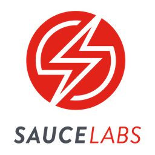

# Sauce Labs Quick Start

### `Mobile Beta Testing Edition`  
_Powered by TestFairy™_

<br>

_This source code is licensed under the MIT license found in the LICENSE file in the root directory of this source tree._

<br>
  


| :rocket: [Sign Up for a _free_ trial at Sauce Labs][00] :bangbang:       |
|:-------------------------------------------------------------------------|
| :page_facing_up: [Mobile Beta Testing Documentation][20]                |
| :page_facing_up: [Mobile Beta Testing API][21]                          |
| :page_facing_up: [5 Minute Onboarding Video][22]                     |
| :page_facing_up: [My Demo App (SDK Reference Implementation)][30]       |
| :page_facing_up: _`saucelabs`_ [Documentation Home][10]                  |
| :page_facing_up: _`saucelabs`_ [Knowledge Base][11]                      |


[00]: https://saucelabs.com/sign-up
[10]: https://docs.saucelabs.com/overview/
[11]: https://support.saucelabs.com/hc/en-us#knowledge-base
[20]: https://docs.testfairy.com/
[21]: https://docs.testfairy.com/API/Upload_API.html
[22]: https://vimeo.com/649086837

[30]: https://github.com/kmissoumi/my-demo-app-android

[500]: https://app.testfairy.com/settings/
[501]: https://app.testfairy.com/settings/access-key

[400]: https://docs.testfairy.com/SDK/Identifying_Your_Users.html


<br>
<br>

## Setup

<br>


### **Collect** Account Info
 You will need your [TestFairy Access Key][600] to use the [buildEnv][700] script.  
 The script uploads various configurations of the _Sauce Labs My Demo App_ to simulate a realistic app distribution dashboard.

<br>


### **Upload** Apps

```shell
repoURL="https://github.com/kmissoumi/sauce-101-beta-testing"
release="orange-0.0.1"

# clone repo
git clone ${repoURL} && cd sauce-101-beta-testing

# download my demo app
curl --get --location ${repoURL}/releases/download/${release}/my-demo-app.apk --output apps/my-demo-app.apk
curl --get --location ${repoURL}/releases/download/${release}/my-demo-app.ipa --output apps/my-demo-app.ipa

# set your access key
export TESTFAIRY_ACCESS_KEY=""

# off blast!
./buildEnv
```

<br>


### **Import** Users and Groups

* Open the [TestFairy Testers Import][602] page.
  * Select the _browse_ button.
  * Select the [testFairy-betaTesters][701] CSV file located in this repository.
  * Click the blue _Upload Testers File_ button.
* Navigate to the [TestFairy Beta Testers Menu][603].
  * This page shows you an overview of all your beta testers and groups.

<br>
<br>


## Configure

<br>


### Project Settings

The group assignments are managed per app. Navigate to the _[Apps Menu][604]_ and select _My Demo App Android_. The default tab shows you all the available _builds. You can assign default groups to each project, and you can also invite testers to a specific build as needed.

The 2nd _[Landing Page][605]_ 

The 3rd time allows you to manage the default _[Permissionsdefault group is also configurable on the permissions tab.


Hopefully these quick start assets have aided in your discovery of the Sauce Labs Beta Testing toolkit. Please review the documentation for the latest configuration and 

[701]: ./config/testers/testFairy-betaTesters.csv
[700]: ./buildEnv


[605]: https://docs.testfairy.com/App_Distribution/Landing_Pages.html
[604]: https://app.testfairy.com/
[603]: https://app.testfairy.com/testers
[602]: https://app.testfairy.com/testers/import/
[600]: https://app.testfairy.com/settings/access-key

